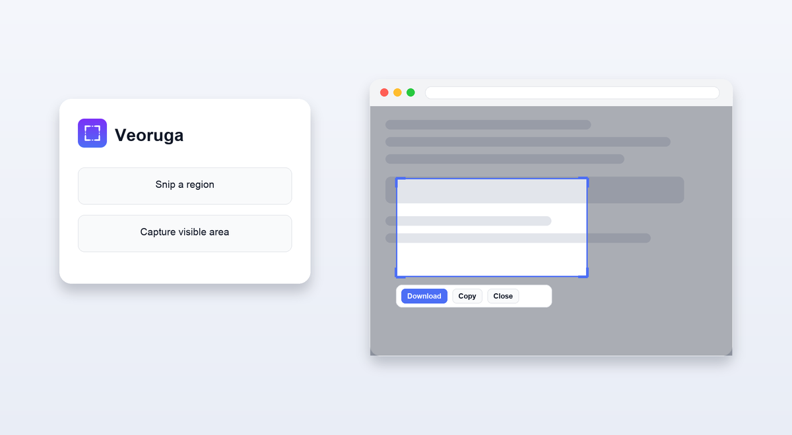

# Veoruga — Screenshot & Snip

A tiny, privacy-respecting Chrome extension for capturing web pages. Click the
toolbar icon to **Snip a region** or **Capture visible area**, then **download**
the PNG or **copy** it to your clipboard.

Everything runs locally. No servers, no tracking, no host permissions.



## Features

- **Snip a region** — drag to select any part of the page (Firefox-style
  dimmed overlay). Esc cancels.
- **Capture visible area** — grab the whole viewport from the popup.
- **Download** as a timestamped PNG, or **Copy** straight to the clipboard.
- **Minimal permissions:** only `activeTab` and `scripting`.

## Why the permissions are minimal

| Permission  | Why it's needed |
|-------------|-----------------|
| `activeTab` | Temporary access to the current tab **only when you invoke the extension**, so it can capture that page's pixels. No standing access to any site. |
| `scripting` | Injects the region-selection overlay when you snip. |

No `<all_urls>`/host permissions, no `storage`, no `downloads`, no network. See
[PRIVACY.md](PRIVACY.md).

## Load it locally (developer mode)

1. Open `chrome://extensions`.
2. Toggle **Developer mode** (top-right).
3. Click **Load unpacked** and select this `veoruga-extension` folder.
4. Pin the Veoruga icon and click it on any normal web page.

> System pages (`chrome://…`), the Chrome Web Store, and other extensions' pages
> can't be captured — Chrome forbids it for all extensions. The popup will tell
> you when you're on one.

## Publish to the Chrome Web Store

1. Bump `version` in `manifest.json` if needed.
2. Zip the **contents** of this folder (not the folder itself):
   ```bash
   cd veoruga-extension
   zip -r ../veoruga.zip . -x "make_icons.py" "README.md" "STORE_LISTING.md" "*.DS_Store"
   ```
3. Go to the [Chrome Web Store Developer Dashboard](https://chrome.google.com/webstore/devconsole),
   create a new item, and upload `veoruga.zip`.
4. Fill in the listing (see [STORE_LISTING.md](STORE_LISTING.md)), link this
   privacy policy, complete the data-usage disclosures (declare **no data
   collected**), and submit for review.

## Project layout

```
veoruga-extension/
├── manifest.json          # MV3 manifest + permissions
├── background.js          # service worker: injects overlay, captures viewport
├── overlay.js/.css        # on-page region selector + result toolbar
├── popup.html/.css/.js    # toolbar popup: actions + visible-area preview
├── icons/                 # 16/32/48/128 px PNGs
├── make_icons.py          # regenerates the icons (dev only; not shipped)
├── PRIVACY.md             # privacy policy
├── STORE_LISTING.md       # copy for the store listing
└── LICENSE
```

## Regenerating icons (optional)

```bash
python3 make_icons.py   # requires Pillow
```

## License

MIT — see [LICENSE](LICENSE).
